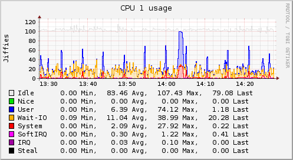

# collectd – The system statistics collection daemon

**collectd** is a
[daemon](http://en.wikipedia.org/wiki/Daemon_%28computing%29) collecting system
and application performance metrics periodically and provides mechanisms to
store the values in a variety of ways, for example in [RRD
files](http://oss.oetiker.ch/rrdtool/).

## What does collectd do?

collectd gathers metrics from various sources, e.g. the operating system,
applications, logfiles and external devices, and stores this information or
makes it available over the network.  Those statistics can be used to monitor
systems, find performance bottlenecks (i.e. *performance analysis*) and predict
future system load (i.e. *capacity planning*). Or if you just want pretty graphs
of your private server and are fed up with some homegrown solution you're at the
right place, too&nbsp;;).

A graph can say more than a thousand words, so here's a graph showing the [CPU
utilization](/wiki/index.php/Plugin:CPU) of a system over the last
60&nbsp;minutes:

## Why collectd?

There are other free, open source projects that are similar to collectd&nbsp;– a
few links are listed on the [related sites](related.md) page. So why should you
use collectd? There are some key differences we think set collectd apart. For
one, it's written in C for performance and portability, allowing it to run on
systems without scripting language or cron daemon, such as embedded systems.
For example, collectd is popular on *OpenWrt*, a Linux distribution for home
routers.

At the same time it includes optimizations and features to handle hundreds of
thousands of metrics. The daemon comes with [over
100&nbsp;plugins](/wiki/index.php/Table_of_Plugins) which range from standard
cases to very specialized and advanced topics. It provides powerful networking
features and is extensible in numerous ways. Last but not least: collectd is
actively developed and supported and well documented. A more complete [list of
features](features.shtml) is available in our wiki.

### Limitations

While collectd [can do a lot for you](features.md) and your operational needs,
there are limits to what it does:

*   It does not generate graphs. It can write to [RRD
    files](http://oss.oetiker.ch/rrdtool/), but it cannot generate graphs from
    these files. There's a tiny [sample
    script](/wiki/index.php/First_steps#Creating_graphs) included in `contrib/`,
    though.
    
    You can take a look at
    [kcollectd](http://www.forwiss.uni-passau.de/~berberic/Linux/kcollectd.html),
    an X&nbsp;frontend, and [ddraw](http://web.taranis.org/drraw/), a very
    generic solution. More utility programs are listed on the [related
    projects](related.md) page.

*   Monitoring functionality has been added in version&nbsp;4.3, but is so far
    limited to simple threshold checking. The document
    [Notifications and thresholds](/wiki/index.php/Notifications_and_thresholds)
    describes collectd's monitoring concept and has some details on the
    limitations, too. Also, there's a plugin for [Nagios](http://nagios.org/),
    so it can use the metrics provided by collectd.